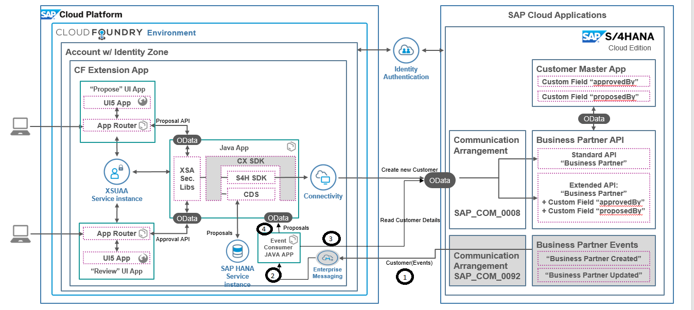

# persephone-event-consumer

## Description
This app enables user to subscribe for specific queue of enterprise messaging service and process events. 

[Enterprise Messaging Service](https://wiki.wdf.sap.corp/wiki/display/CoCo/Enterprise+Messaging+on+SAP+CP+CF+-+Getting+Started) available in SAP Cloud Platform CF enables users to implement event-driven architecture.Key features of messaging service are - 
1. Java API to send and recieve events. 
2. Native integration with S4Hana to fire events from S4Hana and consume same in cloud platform

# Table of Contents
* [Test Scenario](README.md#1.Test-Scenario)
* [Installation](README.md#2.Installation)
* [Running Application](README.md#3.Running-Application)
* [Contribution Guide](README.md#4.Contributing)
* [Code Walkthrough](README.md#5.Code-Walkthrough)

# 1.Test Scenario
Persephone project enables developers to develop S4Hana extension using SAP Cloud Platform. Sample extension app allows customers to create proposals for business partners and approve same ; once approved Business Partner is created in S4Hana with additional metadata of proposer.In this project we extend persephone scenario with events to close proposal if similar BusinessPartner was created in S4Hana backend by another workflow or app. Here are the steps to implement same - 

  

1. Fire  events from S4Hana on creation of new Business Partner(BuPa)
2. Receive events in Java app deployed in SAP Cloud Platform CF
3. Fetch more details for Business Partner from S4Hana using Odata API based on ID in event
4. Compare new BuPa with proposals in extension app ([Persephone](https://github.wdf.sap.corp/SolutionPioneering/persephone-cpl281-app/blob/master/README.md)) and close proposal if same as newly created BuPa in back end. 


# 2.Installation
## Enable events propogation from S4Hana
To enable communication between S4Hana and CF system in step 1, refer [here](https://wiki.wdf.sap.corp/wiki/pages/viewpage.action?pageId=1938428477) and to setup messaging instance and queue , refer [here](https://wiki.wdf.sap.corp/wiki/display/CoCo/Enterprise+Messaging+on+SAP+CP+CF+-+Getting+Started)

Note :- Name of messaging service instance should be 'messaging' , in case you create a service instance with different name please update same in manifest.yml file
Note :- Name of queue should be 'Persephone_Queue' , in case you create a queue with different name please update same in manifest.yml file


## Create S4HANA Destination
Java Application needs a destination pointing to the S4HANA system for step 3 which provides the API, in our case API_Business_Partner OData service.
1. Login to the Cloud Foundry trial account : https://account.hanatrial.ondemand.com/cockpit#/home/trialhome
2. Click on 'Cloud Foundry Trial' to go to the Cloud Foundry Global Account.
3. Click on 'trial' to go to the trial sub-account.
4. In the Left pane, expand 'Connectivity' and Click on 'Destinations (Beta)'
5. Click on 'Create Destination' and enter URL for S4Hana and enter credentials for basic auth. Name of destination should be S4HANA2
6. Click on 'Save' and save the destination.
7. Make sure you name the destination as 'S4HANA2' as the destination name is hard-coded in java code

Note :- For calling S4Hana OData API , you need to create communication user and arrangement in S4Hana , refer [here](https://help.sap.com/viewer/f544846954f24b9183eddadcc41bdc3b/1705%20500/en-US/2e84a10c430645a88bdbfaaa23ac9ff7.html)

Note :- Name of destination service instance should be 'dest-service' , in case you create a service instance with different name please update same in manifest.yml file


## Create Proposal APP Destination
Events Java Application needs a destination pointing to the Proposal APP system for step 4 which provides the API for reading and closing proposals.
1. Login to the Cloud Foundry trial account : https://account.hanatrial.ondemand.com/cockpit#/home/trialhome
2. Click on 'Cloud Foundry Trial' to go to the Cloud Foundry Global Account.
3. Click on 'trial' to go to the trial sub-account.
4. In the Left pane, expand 'Connectivity' and Click on 'Destinations (Beta)'
5. Click on 'Create Destination' and enter URL for UAA service of proposal app and enter credentials(client id/client secret) for basic auth. Name of destination should be S4HANA2. You can get these values from environment variables of your app or UAA service in cockpit
6. Click on 'Save' and save the destination.
7. Make sure you name the destination as 'PROPOSAL_APP' as the destination name is hard-coded in java code


##  Get project sources local
Use git clone \<project URL.git\>_ to download the zip of this project to a local folder.


## Build the <events>.jar
1. Open a command window. 
2. Adapt application name and host    
3. Build the jar file using maven
    ```
    mvn clean install
    ```

## Deploy the app to your CF Account
>**Precondition:** You have already build your war file in the root directory. 
1. Via console login to your account. eg. if working on Europe: 
    ```
    cf api https://api.cf.eu10.hana.ondemand.com
    cf login 
    ```
    >**Hint:** If you want to find out which target are you currently using:
    > ```
    >  cf target
    >  ```
2. Run the command **push** of the **CLI**:
    ```
    cf push
    ```


   
# 3.Running Application
* Landscape
	* [CP System - Canary ](https://account.int.sap.hana.ondemand.com/cockpit#/region/cf-eu10-canary/globalaccount/1365535c-4114-44c2-bfa3-456a39e7c1ee/subaccount/a19ed5c1-386b-4974-b082-258fe5c8e403/org/c9166464-dbb1-4bc3-8383-add0f4314904/space/cfbc1fee-7870-4dfc-8994-26a5b2353be6/applications)
	* [S4Hana System - Canary CXT](https://my300532.s4hana.ondemand.com/ui) 
* Open Events APP - https://i030998-event-publisher.cfapps.sap.hana.ondemand.com/messages
* Postman Setup
    * Import attached [postman collection](docs/Events_Demo.postman_collection.json) and try
    *  Set postman environment variable - s4hana for request as 'my300532.s4hana.ondemand.com'
* Create Business Partner
    * First execute fetch token call , take csrf token and copy to header in post business partner call
    * In 'Post business parter' call , atleast replace all Demo11 with new values e.g. Demo769809 and execute request
    * Check in S4Hana BuPa is created
    * Check in events app url , you should see new message
* Create Proposal
    * Navigate to proposal app (https://cp-persephone-proposalapp.cfapps.sap.hana.ondemand.com/proposalapp/index.html )
    * Create new proposal ( Note:- if you select Germany/India as country please change id type to SWIFT else it will be auto processed by workflow)
* Create Duplicate Business Partner using postman
    * Once again fire business partner call from postman with data similar to proposal app 
    * Check in S4Hana BuPa is created
    * Check in proposal app , proposal should be updated to closed


# 4.Code Walkthrough

* Package com.example.base.destination
    * [DestinationAccessor](/event-consumer-app/src/main/java/com/example/base/destination/DestinationAccessor.java) class is used to read destination data for your CF account
* Package com.example.base.utils
    * API Handler class is a wrapper over springframework http to fire get/post calls
* Package com.example.demo - Main package which contains actual events subscription and handling ligic
    * DemoApplication is our base sprint application
    * MessageController hosts REST servlet with get and post message to send messages to queue or reads messages recieved 
    * MessageEvent is model to hold message
    * [MessageService](/event-consumer-app/src/main/java/com/example/demo/MessageService.java) is main event service class which subscribes to CF event service 
* Package com.example.S4Hana
    * BaseEntity is model to hold common properties between Customer and Proposal
    * Customer is model to hold customer details
    * [S4HanaAPIFacade](/event-consumer-app/src/main/java/com/example/s4hana/S4HanaApiFacade.java) is facade to read customer details from S4Hana system using OData API and destinations
* Package com.example.S4Hana.proposal
    * Proposal is model to hold proposal details
    * [Proposal API Facade](/event-consumer-app/src/main/java/com/example/s4hana/proposal/ProposalAPIFacade.java) is used to work with REST apis exposed by proposal extension to compare proposal and close duplicate proposal

## Security Settings

* Communication between APP and Destination Service
    * Events APP is binded to destination service via manifest.yml file
    * We can read details of connectivity details for destination service from environment variables of app
    * To work with destination URL , we need to first fetch JWT token using client crdential grant type
    * Using JWT token we can fetch destination service details
    
* Communication between APP and S4Hana
    * Enable inbound communication user in S4Hana
    * Create destination in CP , for S4Hana URL and communication user
    * Use destination details to send get call to S4Hana

* Communication between APP and Proposal Java APP
    * Give grant in xs-security.json of UAA for Java APP .More details on same [here](https://github.wdf.sap.corp/xs2-samples/security-feature-demo)
    * In xs-security.json of Events APP , accept granted authorities
    * Fetch JWT_Token using clientid , client secret of UAA for Java APP.
    * Use JWT_Token as Bearer token to call Java APP

# 5.Contributing
Find the contribution guide here: [Contribution Guidelines](docs/CONTRIBUTING.md)
